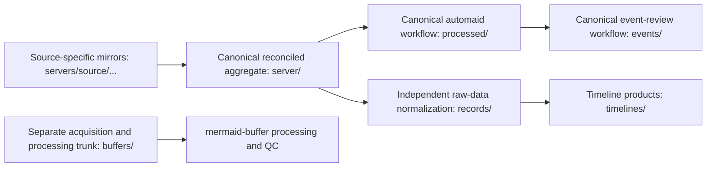
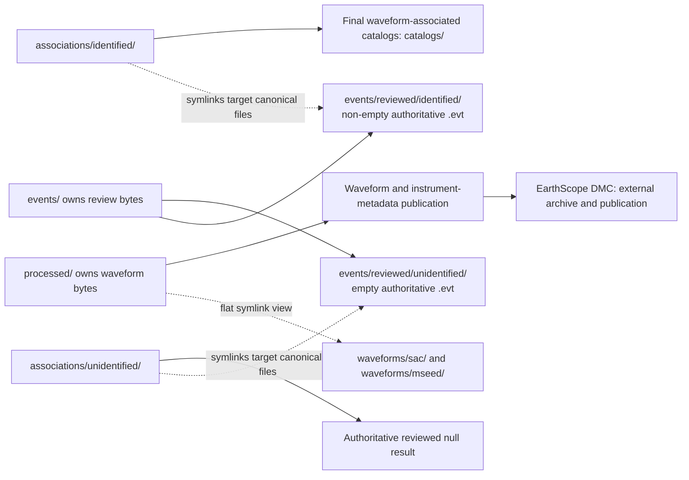

# MERMAID Data Lifecycle

This document describes the planned relationships among MERMAID data trees. It distinguishes byte-owning workflow trees from curated symlink views, independent processing branches, and external systems. It is an architectural model, not a migration plan or a claim that all consumers have already moved to new views.

## Canonical lifecycle and independent branches

`servers/<user-or-source>/...` names a possible source-specific acquisition layout; its exact naming is not frozen. These mirrors preserve acquisition provenance and can overlap. `server/` is the real, byte-owning canonical aggregate, which may reconcile overlapping upstream copies. The intended direction is to reclaim the unsuffixed `server/` name for this aggregate rather than continue with a `_everyone` suffix; migration mechanics remain unresolved.

`processed/` remains the canonical, heterogeneous automaid output and workflow tree. It owns waveform bytes and contains more than waveform products. Existing default automaid behavior and consumers using `processed/` remain unchanged.

`events/` remains the byte-owning event-review workflow tree. It includes candidate material and reviewed identified and unidentified outcomes, as well as other workflow artifacts. Candidate data remain durable after review. An identified reviewed `.evt` contains the one selected authoritative association; if no acceptable event exists, the reviewed/unidentified workflow retains an empty `.evt`.

`records/` is a separate raw-data normalization branch. `mermaid-records` consumes raw data directly, not `processed/`, `waveforms/`, instrument metadata, `associations/`, or `catalogs/`. `timelines/` is downstream of `records/`. `buffers/` is likewise a separate acquisition/data trunk, with continuous or year-scale observations and its own timing and QC needs; it is not a DET/REQ subtype or a consequence of the main `server/` to `processed/` workflow.

## Curated views and publication

`waveforms/` is a new flat symlink view for efficient lookup of canonical SAC and miniSEED files physically owned under `processed/`. DET and REQ are both waveform types, not separate top-level streams. SAC files remain writable: writing through a symlink changes the canonical target. New or migrated consumers may use this view, while existing `processed/` users continue to work.

`associations/` is a new curated symlink view of all reviewed `.evt` outcomes. Its `identified/` and `unidentified/` subdirectories contain symlinks that point to the byte-owning canonical files in `events/reviewed/identified/` and `events/reviewed/unidentified/`, respectively. Identified files are non-empty authoritative waveform-to-event associations; unidentified files are empty authoritative reviewed null results, meaning no acceptable event association exists. Candidate and preliminary `.evt` sets remain only in the broader `events/` workflow and are not exposed through `associations/`. A waveform may have no identified association, so the positive relationship is not strictly one-to-one; when one exists, matching waveform and `.evt` basenames provide a useful lookup contract.

`catalogs/` contains final MERMAID waveform-associated catalog products, made fundamentally by `mermaid-catalogs`. They are downstream only of reviewed identified associations; reviewed unidentified results terminate as authoritative null outcomes and do not feed a positive event catalog. Catalog generation can use preliminary products such as `tomocat1`, MERMAID instrument/location information such as GeoCSV, waveform verification via ObsPy, and `cfneic` refinements. The association does not change during refinement, but event origin, location, depth, magnitude, or source identifiers may be updated from preliminary information (for example USGS PDE) to reviewed published catalogs such as ISC. Catalog products can include travel times, residuals, phase arrivals, and other quantities derived from finalized event locations. Complete external ISC, NEIC, and GCMT catalogs remain reference data outside the MERMAID data tree.

EarthScope DMC is an external terminal archival/publication node for the waveform and instrument-metadata publication branch. It is distinct from the MERMAID-side EarthScope-Oceans project and is not an internal directory.

## Instrument metadata and event metadata

MERMAID instrument metadata includes GPS positions, GeoCSV products, dives, engineering telemetry, battery information, and instrument configuration. Event/source metadata includes origin time, location, depth, magnitude, and ISC, NEIC, PDE, or GCMT identifiers. Event metadata belongs to the association/catalog workflow, not to the instrument-metadata concept.

Because `processed/` remains a heterogeneous automaid tree, the future shape of a clean top-level instrument `metadata/` view is unresolved. This document does not prescribe one.

## Unresolved and future concepts

### CTD/profile observations

CTD profiles are candidate first-class scientific observations, not simply instrument metadata. A future `profiles/` data family is plausible but remains an open architecture decision.

### GCMT products

The final home for future `mermaid-gcmt` outputs remains unresolved. Possible homes include `associations/`, `catalogs/`, or another future data family.

### Future automaid waveform-root mode

A future opt-in automaid mode might place canonical waveform bytes elsewhere and retain compatibility symlinks in `processed/`. That is not the current plan: today `processed/` owns waveform bytes and `waveforms/` is its symlink view.

## Bundled repository-document snapshots

`repo_docs/` contains bundled upstream documentation snapshots. It is not rewritten as part of this architecture pass. In particular, the directory name `repo_docs/mermaid-timeline/` and some package/CLI references inside its snapshot retain the former singular name, although the current repository is `mermaid-timelines`. These historical references are intentionally left intact until the snapshot is refreshed from its source.
